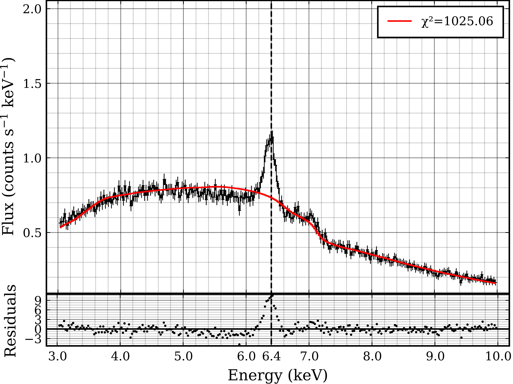
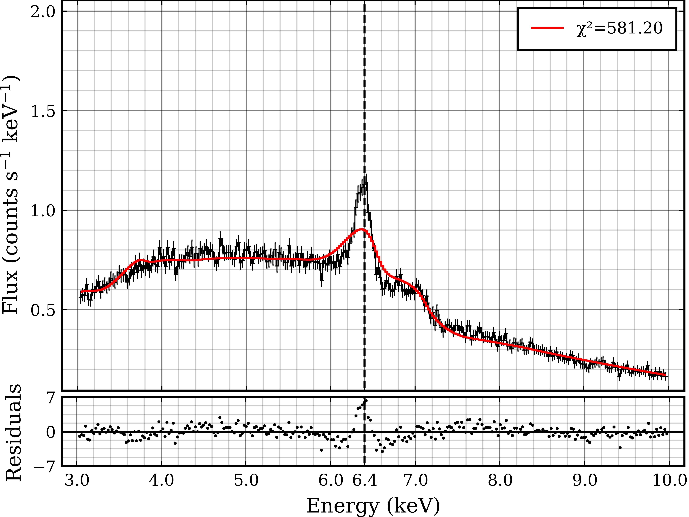

# Fitting the Refined Model to the Data

With the table model constructed and the parameter space now understood, it was possible to start fitting to data. To refine the fitting process the processed XRISM dataset of NGC4151 was used. Modifications had to be made to the previous fitting code to include a rest frame spectrum, and photoelectric absorption. The rest frame model `XILLVER` was selected as implemented through `SpectralFitting.jl`.

The model used was:
```
PhotoelectricAbsorption * (PowerLaw + ConvolutionLineProfile(XillverD5))
```

where `PhotoelectricAbsorption`, `PowerLaw`, and `XillverD5` were implemented through `SpectralFitting.jl`. `ConvolutionLineProfile` is the table model defined here using the Johannsen metric, and convolving over the reflection spectrum to apply the relativistic properties to the emission lines. The parameters of the model are shown below. Note that the photon index appears in both the spectrum and the power law, and the inclination appears in both the spectrum and the line profile. These two pairs of parameters were bound together for fitting.

| Component    | Parameter                             | Initial Value | Bounds        |
|--------------|---------------------------------------|---------------|---------------|
| Line Profile | Spin ($a$)                            | 0.998         | (0, 0.998)    |
|              | Corona Height ($h$)                   | 19            | (3, 19)       |
|              | Inclination ($\theta$)                | 15            | (5, 85)       |
|              | $\alpha_{13}$                         | 0             | (-6, 10)      |
|              | $\epsilon_{3}$                        | 0             | (-8, 10)      |
| `XILLVER`    | Normalisation ($K$)                   | 0.01          | (0, $\infty$) |
|              | Photon Index ($\Gamma$)               | 3.5           | (1, 5)        |
|              | Iron Abundance ($A_{\rm Fe}$)         | 1             | (0, 2)        |
|              | Ionisation ($\log\xi$)                | 0.5           | (0, 4)        |
|              | Density                               | 30            | (1, 30)       |
|              | Inclination ($\theta$)                | 15            | (5, 85)       |
| Absorption   | Equivalent H column density ($\eta$H) | 10            | (0, 30)       |
| Power Law    | Normalisation ($K$)                   | 40,000        | (0, $\infty$) |
|              | Photon Index ($\Gamma$)               | 3.5           | (1, 5)        |

To fit the model the data was first rebinned from 4096 channels to 1024 to reduce the complexity of the data. Rebinning was completed with `grppha`. This configuration resulted in the fit below, using 10,000 iterations.

{fig-align="center" width=80% #fig-FirstFit}

The fit modelled the underlying distribution well, however failed to capture the Fe K$\alpha$ line. Following this, the fitted parameters were input as initial parameters for a testing model, and the spectrum viewed through `SpectralFitting.invokemodel`. This allowed for manual tuning of the parameters to give the model a best first estimate of the model. The major modifications were made to the iron abundance, corona height and inclination. The profile of the iron line for this dataset is relatively narrow thus it was found that a low inclination and high corona height yielded the closest shape. The line profile table model is currently limited to only 19 $R_G$, thus the model will need to be expanded slightly. Another modification made was to the energy of the line profile. For now, the model was extrapolated to test this theory. It was noticed that the model iron line peaked slightly leftward of the data, thus increasing the energy slightly was able to shift it rightward.

| Component    | Parameter                             | Initial Value | Bounds        |
|--------------|---------------------------------------|---------------|---------------|
| Line Profile | Spin ($a$)                            | 0.998         | (0, 0.998)    |
|              | Corona Height ($h$)                   | 41.145        | (3, 19)       |
|              | Inclination ($\theta$)                | 5             | (5, 85)       |
|              | $\alpha_{13}$                         | 0             | (-6, 10)      |
|              | $\epsilon_{3}$                        | 0             | (-8, 10)      |
|              | Energy ($E$)                          | 1.02          | (1, 1.05)     |
| `XILLVER`    | Normalisation ($K$)                   | 1.15e-7       | (0, $\infty$) |
|              | Photon Index ($\Gamma$)               | 3.48          | (1, 5)        |
|              | Iron Abundance ($A_{\rm Fe}$)         | 0.963         | (0, 2)        |
|              | Ionisation ($\log\xi$)                | 0.467         | (0, 4)        |
|              | Density                               | 19.9          | (1, 30)       |
|              | Inclination ($\theta$)                | 5             | (5, 85)       |
| Absorption   | Equivalent H column density ($\eta$H) | 9.5425        | (0, 30)       |
| Power Law    | Normalisation ($K$)                   | 0.27368       | (0, $\infty$) |
|              | Photon Index ($\Gamma$)               | 3.48          | (1, 5)        |

Many of these parameters were guided by the fit shown in @fig-FirstFit. These changes allowed the fit to converge much better as shown below.

{fig-align="center" width=80% #fig-SecondFit}

The fit again modelled the underlying distribution very well, and now began to model the iron line reasonably well. The main issues that stand are that the fitted iron line is both too broad and too short. From the previously completed investigations of the parameter space, the corona height, $h$ is the most likely contender to decrease the width of the line, and the iron abundance can be increased to increase the height of the line. 

The next steps are thus to increase the scope of the table model allowing for corona heights of up to 100 $R_G$, and potentially higher. 

## 2026/08/03

While the new table data was generating, another model was tested:

```
PhotoelectricAbsorption * (PowerLaw + ConvolutionLineProfile(XillverD5) + LineProfile)
```

Where all is the same as the previous model, but the iron abundance in XILLVER was set to zero, and the Iron K$\alpha$ line was fit independently of the rest of the spectrum using the defined `XS_LamppostJohannsen` table model. This was attempted as a high degree of blurring was evidently necessary to fit the underlying reflection continuum, however this affected the convolution of the iron line profile. It was thus decided to separate the two and fit them independently. The parameters of the convolution model and line profile were all bound to one another, except the energy (which was $\sim 1$ for the convolution and $\sim 6.4$ for the line profile) and the normalisation.

This model was expectedly more complex, but the additional freedom may allow for a better fit to the data.