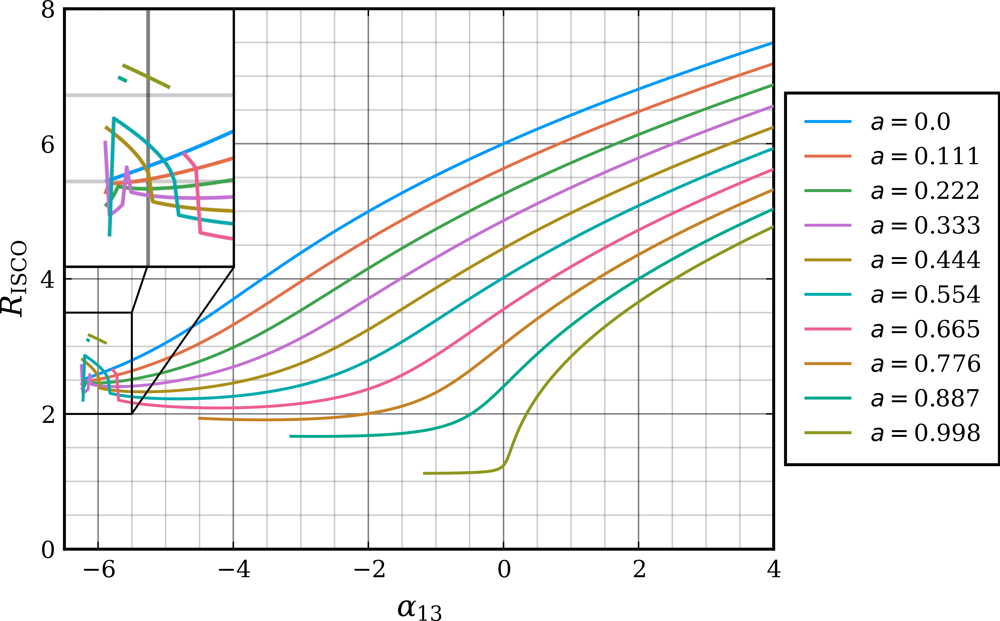
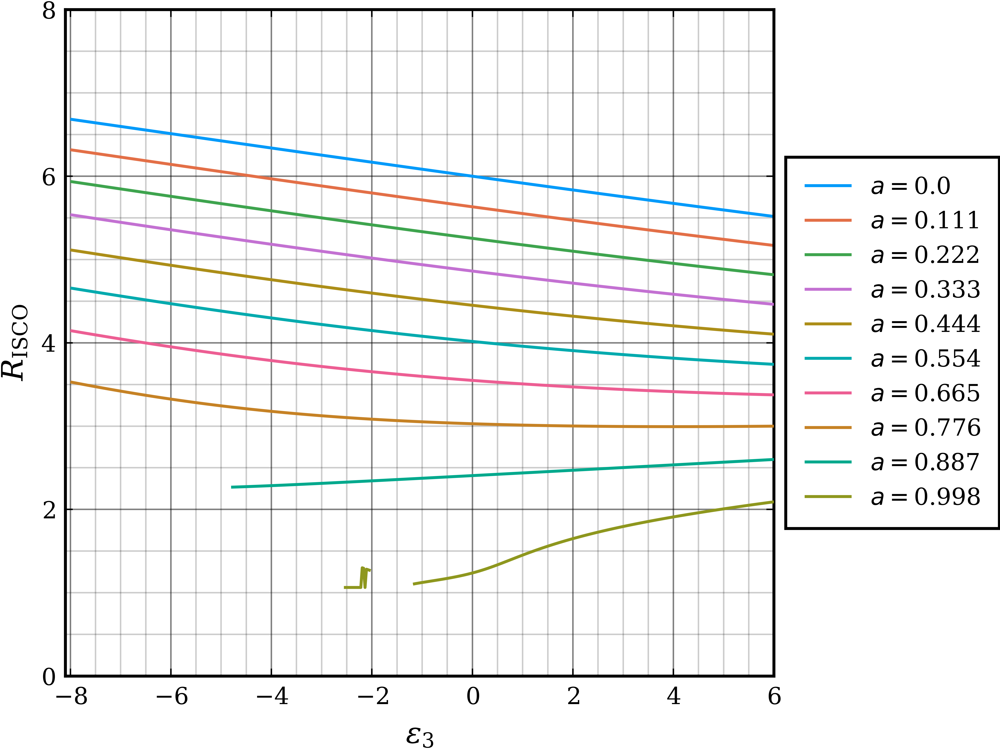

# Properties of the Deformation Parameters

## $\alpha_{13}$

$\alpha_{13}$ is the highest order deformation parameter in the Johannsen metric and thus has the largest effect on the line profile. The animation below shows the effect of $\alpha_{13}$ on the observed image of the disc. The radius of the ISCO and degree of doppler shifting observed both increase with $\alpha_{13}$. The doppler shifting trend agrees with the statement from Johannsen (2013) @JohannsenMetric: "Keplerian frequency increases for increasing values of the parameter $\alpha_{13}$". An increase in orbital frequency leads to an increase in relative speed to an observer, and thus increased redshifting is observed.

{width=80%}

The plot below shows $R_\text{ISCO}$ as a function of $\alpha_{13}$ for varying $a$.

{#fig-alphaISCO width=80%}

For $\alpha_{13} \lesssim -5.7$ the energy can have two local minima and stable circular orbits can only exist at and outside of the radius of the local maximum between them @JohannsenMetric. The effect of this on the ISCO can be seen in @fig-alphaISCO where the behaviour of the ISCO becomes chaotic below $\alpha_{13} \approx -5.7$.

## $\epsilon_{3}$

{width=80% fig-align="center"}

{width=80% fig-align="center"}
