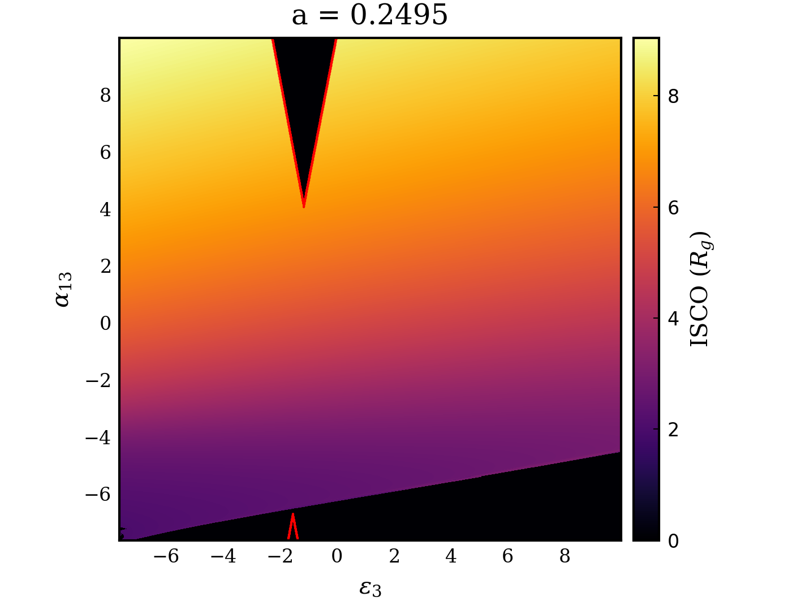
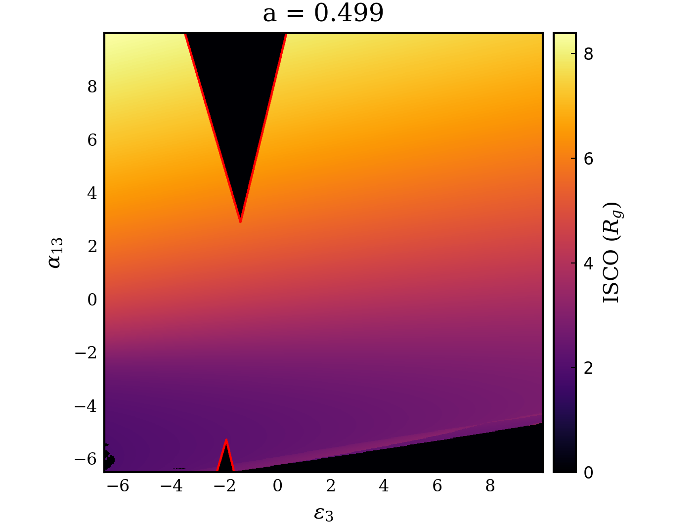
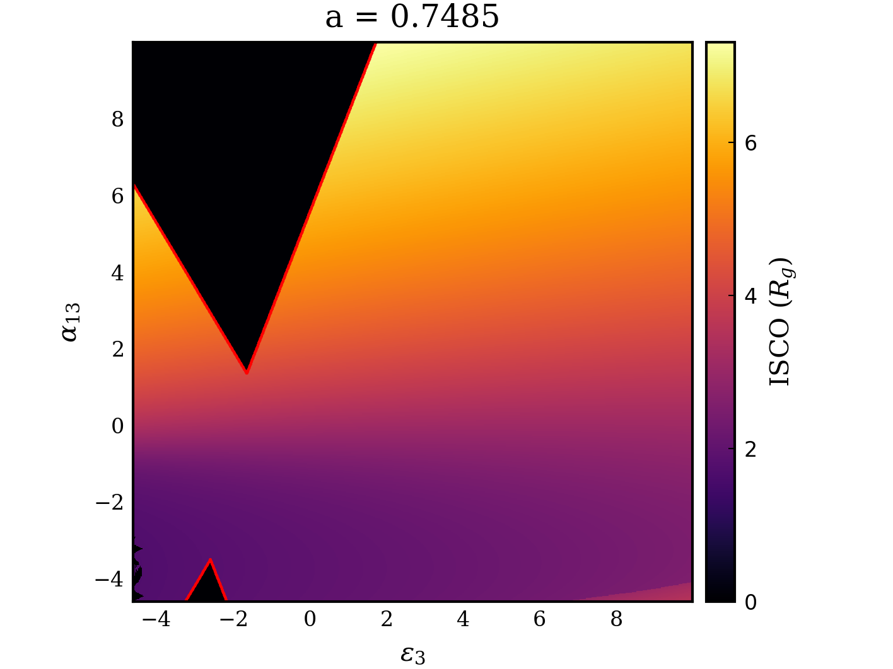
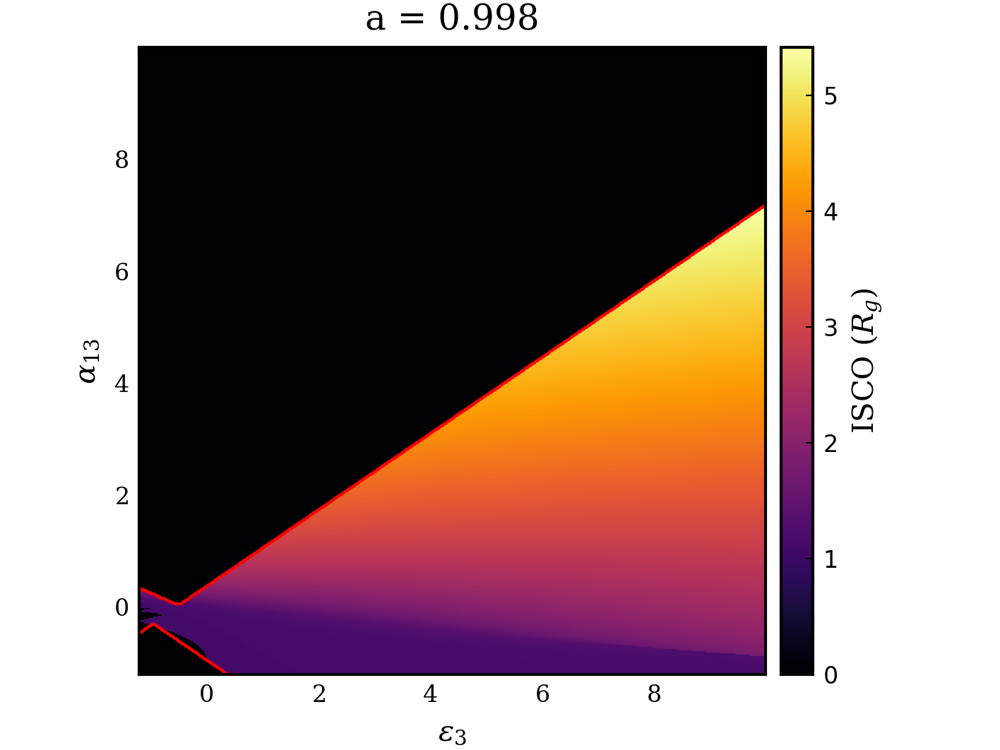
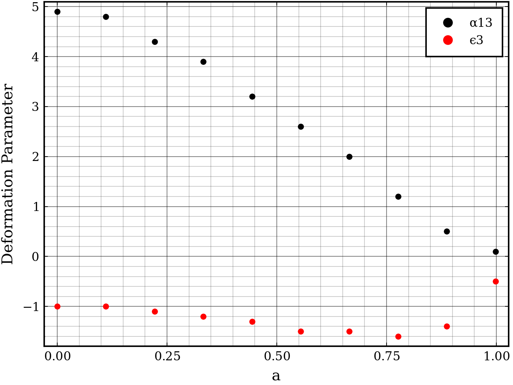

# Further Constraints on the Deformation Parameters

Following a discussion with my supervisors it was found that the issues with negative deformation parameters were not an issue with Gradus but a quirk of the metric. To explore this, a heatmap was plotted of the ISCO for combinations of $\alpha_{13}$ and $\epsilon_{3}$

Doing several of these plots for different values of the spin parameter may permit rigorous constraints of the allowed values of the deformation parameters. This may be done in two ways: 

1. Fitting the data with the Kerr metric to constrain the value of $a$ such that bounds can be determined for the deformation parameters in advance.
2. Somehow dynamically setting constraints on the parameters by selecting from a pre-computed table of allowed combinations for all values of $a$ (permitted by interpolation).
3. Checking the configuration upon each iteration of the fit, and either rejecting the configuration, or manually setting it to an acceptable configuration if it lies within an unphysical region.

The first method would allow for an exploration as to whether the deformation parameters can independently improve the fit of the model, but may reduce the accuracy of the overall fit through forbidding the spin parameter to change. This may be overcome by using the method to obtain a "best guess" for the parameters and then using the result of this for a third and final fit, however this may require implementing the second method also. 

The second method would likely be more computationally complex and introduce an increased amount of uncertainty due to the reliance on interpolation.

The third method is potentially the least complex and introduces the least error as it allows the fit to freely explore the parameter space while guiding it through the process to ensure the results remain physical.

To gather more data on the allowed parameter space, the above image was replicated for 5 spin values as shown below:

:::{layout-ncol=2}

:::

From these plots it seems that it may be possible to empirically parameterise the invalid regions with 5 linear equations: one for the wedge in the bottom right first 3 figures, and two for each of the triangles visible in all cases.

It may be practical to run a selection of cases to find the vertices of these regions such that their position can be plotted as a function of $a$ and then fit to find an empirical expression for the allowed values for any $a$.

To test this hypothesis a quick plot was made with 10 samples of the lower vertex of the triangular region seen in all plots at the top. The result of this is shown below

These example coordinates were found manually inspecting the heatmap with plotly. To find them more precisely, several high definition heatmaps could be produced and the resulting matrix iterated through to find the extrema of each of the shapes. The parameter space could then be constrained by either interpolating the values within a table, or by fitting some function to the data and finding the vertices of these major shapes. 

The vertices can then be used to define bounded exclusion regions, within which the model is invalid. During fitting these exclusion regions can then be used to "reject" a fit and force the parameters into an acceptable range.