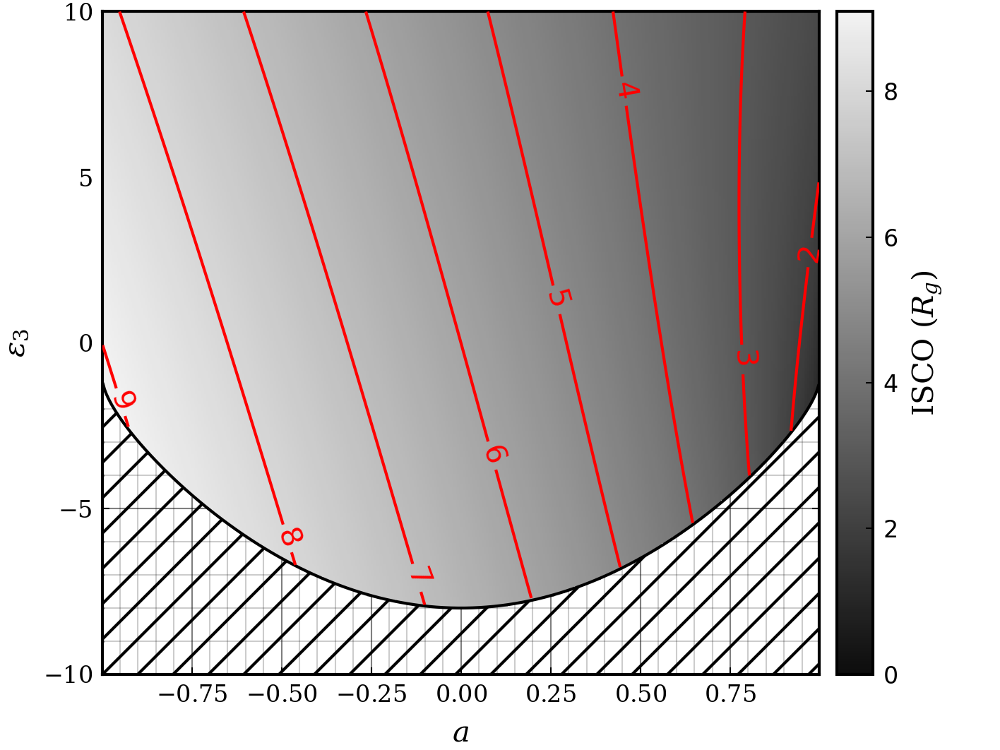
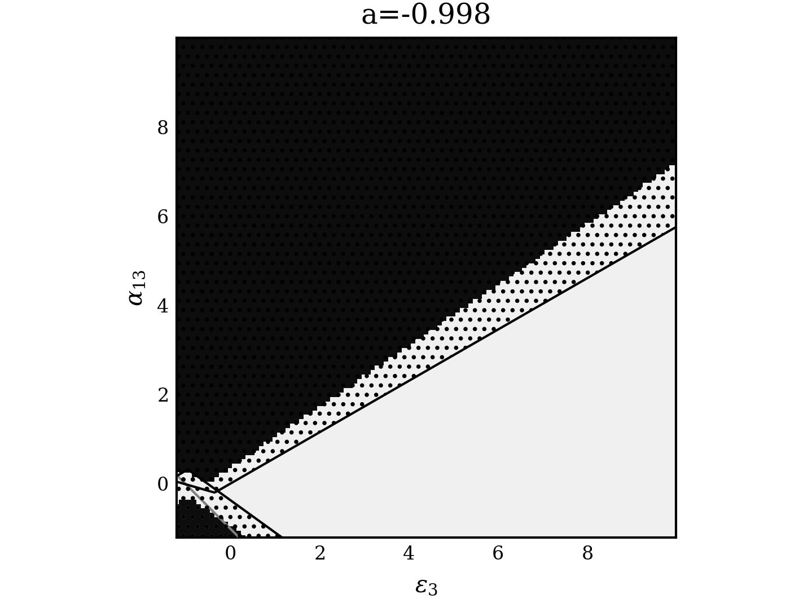

# Further Constraints on the Deformation Parameters

Following a discussion with my supervisors it was found that the issues with negative deformation parameters were not an issue with Gradus but a quirk of the metric. To explore this, a heatmap was plotted of the ISCO for combinations of $\alpha_{13}$ and $\epsilon_{3}$


Doing several of these plots for different values of the spin parameter may permit rigorous constraints of the allowed values of the deformation parameters. This may be done in two ways: 

1. Fitting the data with the Kerr metric to constrain the value of $a$ such that bounds can be determined for the deformation parameters in advance.
2. Somehow dynamically setting constraints on the parameters by selecting from a pre-computed table of allowed combinations for all values of $a$ (permitted by interpolation).
3. Checking the configuration upon each iteration of the fit, and either rejecting the configuration, or manually setting it to an acceptable configuration if it lies within an unphysical region.

The first method would allow for an exploration as to whether the deformation parameters can independently improve the fit of the model, but may reduce the accuracy of the overall fit through forbidding the spin parameter to change. This may be overcome by using the method to obtain a "best guess" for the parameters and then using the result of this for a third and final fit, however this may require implementing the second method also. 

The second method would likely be more computationally complex and introduce an increased amount of uncertainty due to the reliance on interpolation.

The third method is potentially the least complex and introduces the least error as it allows the fit to freely explore the parameter space while guiding it through the process to ensure the results remain physical.

## The Behaviour of the Unphysical Regions

To gather more data on the allowed parameter space, the above image was replicated for 5 spin values as shown below:

:::{layout-ncol=2}


:::

From these plots it seems that it may be possible to empirically parameterise the invalid regions with 5 linear equations: one for the wedge in the bottom right first 3 figures, and two for each of the triangles visible in all cases.

It may be practical to run a selection of cases to find the vertices of these regions such that their position can be plotted as a function of $a$ and then fit to find an empirical expression for the allowed values for any $a$.

To test this hypothesis a quick plot was made with 10 samples of the lower vertex of the triangular region seen in all plots at the top. The result of this is shown below


These example coordinates were found manually inspecting the heatmap with plotly. To find them more precisely, several high definition heatmaps could be produced and the resulting matrix iterated through to find the extrema of each of the shapes. The parameter space could then be constrained by either interpolating the values within a table, or by fitting some function to the data and finding the vertices of these major shapes. 

The vertices can then be used to define bounded exclusion regions, within which the model is invalid. During fitting these exclusion regions can then be used to "reject" a fit and force the parameters into an acceptable range.

## Allowed Values of the Deformation Parameters for Varying Spin

As another investigative route, Figure 6 from @JohannsenMetric was reproduced as below. It was found that the results held consistent between Gradus, and Johannsen's original calculations. The $\alpha_{13}$ parameter space showed an additional region (shown in red) where a naked singularity is present. This was not considered previously, however removes a significant region from the parameter space and will thus be considered here.


{}

## Implementation

### Plan 2026/07/10

The current plan for excluding these unphysical regions of the parameter space from the fitting is as follows. The unphysical regions will be defined by a set of equations for a given spin, and within these regions the fit will be setup to check if the combination is valid. To ensure no invalid combinations are mistakenly used, some padding will be added to these equations such that all invalid combinations are contained within. When the fitting iterator enters an invalid region, the combination will be explicitly checked for naked singularities, or the absence of a valid ISCO. 

If the region is found to be invalid, then the `invoke!` function will return an array of zeros, which will signal to the fitting iterator that the parameter combination is not allowed for fitting. 

A potential roadblock to this process is the unpredictable region in the bottom left corner of the high spin case. This will be dealt with by defining a circular region around this area to catch all of these cases. This will lead to a decrease in efficiency, but will increase the accuracy and thoroughness of the model.

### Notes Following Implementation

The boundary lines were successfully defined by finding the vertices through a grid search defined in `Code/utils/DeformUtils.jl`, and a csv of gradients and intercepts was defined for quick reading of the lines. Padding was added manually to these lines by randomly sampling the parameter space and checking the validity of the combination both using the bounds and explicitly checking the metric. Whenever the bounds missed an invalid point in the parameter space they were adjusted slightly and the process repeated until $10^6$ consecutive random samples could be taken without a point being missed. The bounds were designed to be overzealous such that no valid combinations are missed. 

To avoid removing valid combinations, the fitting process will involve first a quick check with the boundaries, followed by a thorough check with the metric if the first check fails.

The "unpredictable region" noted in the lower left corner was bounded with a line rather than a circle for simplicity.

The call to the bounds within the fitting iterator is shown below

```{.julia .eval-false}
# Reading from table for a quick check of parameter validity
if !QuickIsValid(ϵ3, α13, a)
    # Doing a finer check if the quick check fails
    if !IsValid(ϵ3, α13, a)
        output = fill(NaN, length(input)-1)
        return output
    end
end
```

Here `QuickIsValid` checks the combination using the defined bounds and `IsValid` checks it thoroughly using the metric through `Gradus.jl`. If both checks find the parameter combination to be invalid then the model returns an array of `NaN` for that iteration, such that the iterator will calculate a bad fit and move out of the region. The conditions that are checked through these functions are:

- The presence of a valid ISCO: Checked by defining a metric through `Gradus.jl` and attempting to calculate the isco using `Gradus.ISCO`
- The presence of a naked singularity: Checked using `Gradus.is_naked_singularity`
- If the combination satisfies @eq-Alpha13Constraint and @eq-Epsilon3Constraint
- If the magnitude of the spin is below 0.998

The final check is done as the fitting iterator sometimes exceeds the upper limit, causing the interpolation for the bound definitions to try to extrapolate which causes errors.

The next step is to create a final table model to use for the fit that covers the entire allowed parameter space. In the construction of this, each combination will be checked for a valid ISCO and if @eq-Alpha13Constraint and @eq-Epsilon3Constraint are satisfied. If any of these are not satisfied then that point in the table will be an array of `NaN` to ensure that it does not get used.

