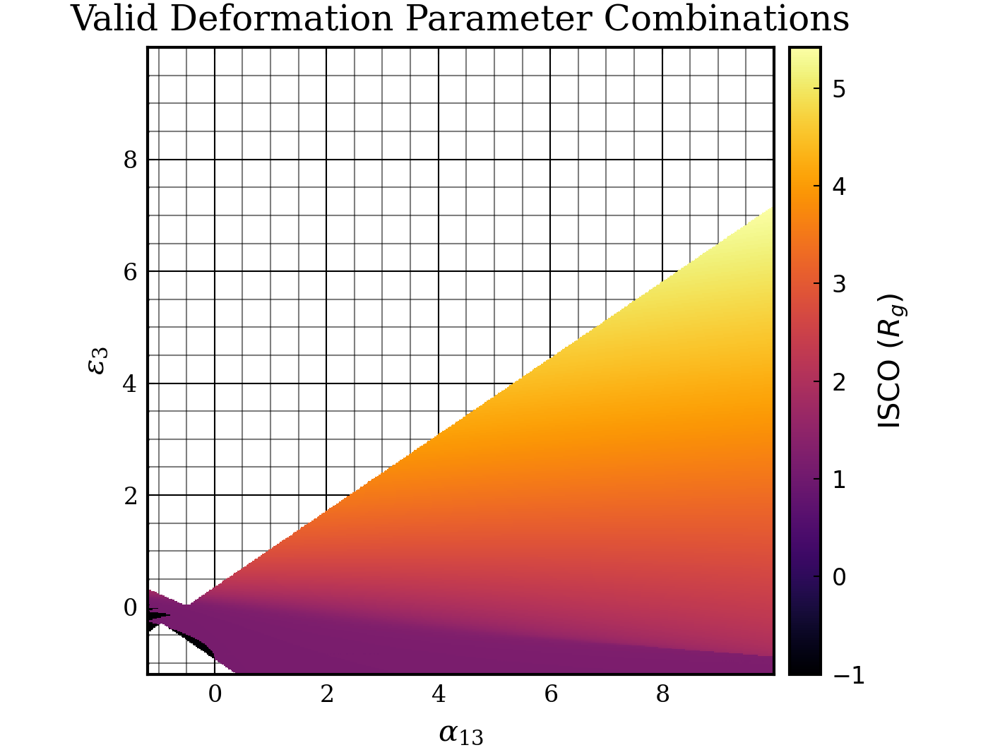

# Further Constraints on the Deformation Parameters

Following a discussion with my supervisors it was found that the issues with negative deformation parameters were not an issue with Gradus but a quirk of the metric. To explore this, a heatmap was plotted of the ISCO for combinations of $\alpha_{13}$ and $\epsilon_{3}$

