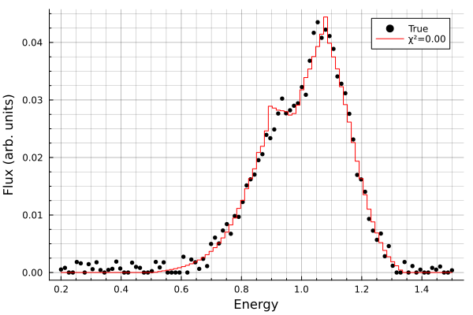

# Fitting Spectral Lines

With the parameter space explored, it was useful to setup the architecture for fitting the model to spectral data. This was done using `SpectralFitting.jl` and defining a custom model using Gradus which fits the following parameters:

| Parameter | Meaning                  |
|-----------|--------------------------|
| `K`       | Normalisation            |
| `h`       | Corona Height            |
| `E`       | Line Energy              |
| `R_in`    | Inner Radius             |
| `R_out`   | Outer Radius             |
| `θ`       | Inclination              |
| `a`       | Spin                     |
| `α13`     | $\alpha_{13}$ Parameter  |
| `ϵ3`      | $\epsilon_{3}$ Parameter |

The architecture of this model was heavily based upon previous work on [GitHub](https://github.com/phajy/DiscAbsorption/blob/main/gradus-lamp-post.jl). 

The model is instantiated using the `LampPostJohannsen` utility function. When called, the parameters are used to instantiate a `JohannsenMetric`, observer position, `ThinDisc`, and an emissivity profile. These are then used to compute the line profile as previously done which is returned. 

All fitting is handled by `SpectralFitting` through the Levenberg Marquadt algorithm. 

To test the implementation a line profile was computed and random noise added to it. This was then passed through the fitting function. The fitting process currently takes a long time and yields poor results so more work is needed. Time was taken to streamline the functionality of main2.jl via keyword arguments and general code cleanup.

{fig-align="center" #fig-FirstFit}

Upon fitting, the error `Warning: No parameter uncertainty estimation due to error: LinearAlgebra.SingularException(3)` occurs and therefore the fit is not currently quantified.

