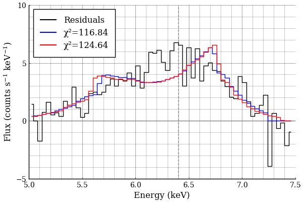
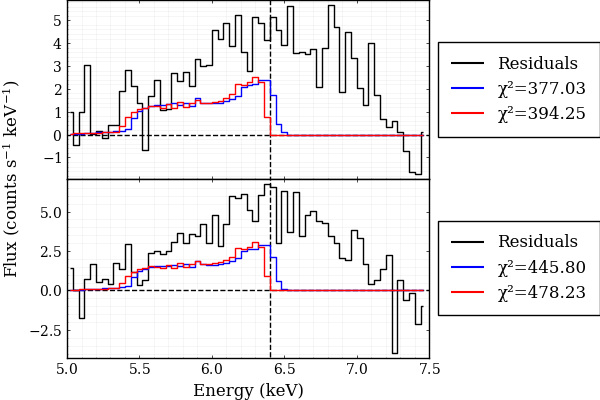
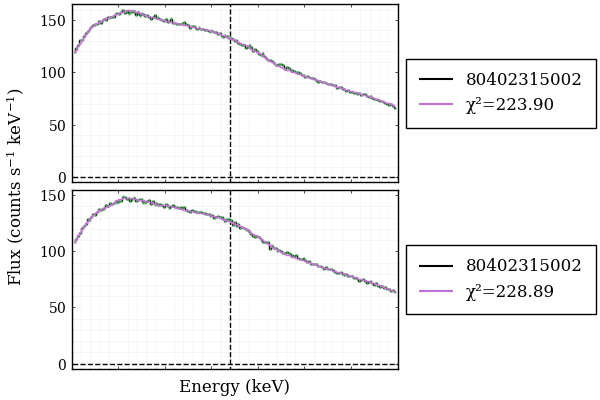
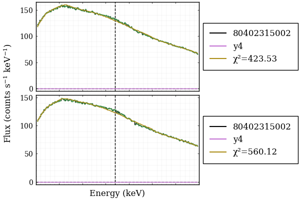
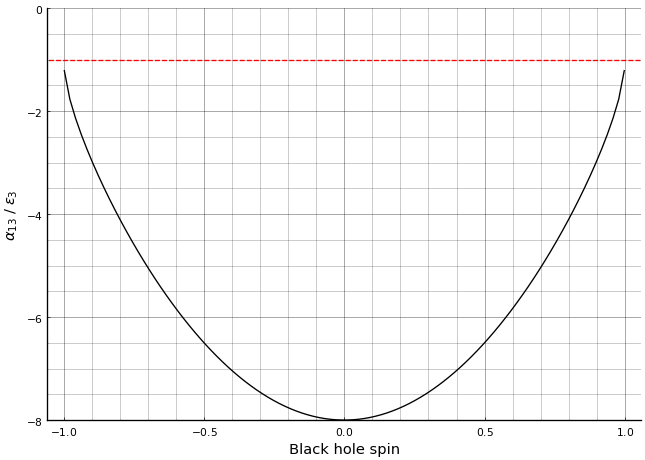

# Fitting to Data

Data from the NuSTAR (Nuclear Spectroscopic Telescope Array) spacecraft @NuSTAR was used, and the dataset used for testing was `nu80402315002B01`. Data loading was handled by `SpectralFitting.jl` through the `OGIPDataset` struct. This takes the spectrum file as an argument and automatically pulls in the background, `.arf`, and `.rmf` files to compute the spectrum.

## Initial Results

| Model     | Variable      | Value | Error | $\chi^2$ |
|-----------|---------------|-------|-------|----------|
| Johannsen | $a$           | 0.57  | 1.88  | 116.84   |
|           | $h$           | 50.00 | 8.77  |          |
|           | $\theta$      | 58.24 | 4.93  |          |
|           | $\alpha_{13}$ | 2.29  | 10.96 |          |
|           | $\epsilon_3$  | 29.74 | 25.89 |          |
|           | $K$           | 161.8 | 7.15  |          |
|           | $E$           | 6.27  | 0.016 |          |
| Kerr      | $a$           | 0.77  | 0.057 | 124.64   |
|           | $h$           | 50.0  | 2.75  |          |
|           | $\theta$      | 55.44 | 2.67  |          |
|           | $K$           | 162.0 | 7.07  |          |
|           | $E$           | 6.27  | 0.014 |          |

: The ranges and default values for the parameter space. {#tbl-InitialFit}

{fig-align="center"}

The NuSTAR datasets have two distinct spectra from each telescope, which can be fit simultaneously, binding some of the parameters together. The fitting code was thus adjusted to fit both datasets simultaneously while binding all parameters other than the normalisation. The dataset labelled "nu80402315002" was once again used.

{fig-align="center" #fig-DualFit}

It is evident from @fig-DualFit that the fitting process needs refinement as the fits do not currently fit the data well, and therefore drawing comparisons would be useless.

Following these experiments it was decided to fit a composite model of `PowerLaw` + `LampPost`, with the latter being the line profiles generated using either the Kerr or Johannsen metric through `Gradus.jl`. The first attempt at this provided the plots below.

{fig-align="center"}

{fig-align="center"}

The inner and outer radii of the accretion disk were set constant at the ISCO and 400 $R_g$ respectively. The Johannsen metric currently seems to yield a better fit, however this appears to be an effect of parameters other than the deformation parameters $\alpha_{13}$ and $\epsilon_{3}$ as they were both relatively small ($1.0285$ and $1.6702\times10^{-5}$, respectively). It may therefore be more effective to investigate the effect of these parameters by first fitting the Kerr metric to the data to find the Kerr parameters, then fitting the Johannsen metric with the found parameters, only allowing the two deformation parameters to vary.

Further reading suggests that it may be possible to constrain the parameters for fitting further. In T. Johannsen's 2013 paper describing the Johannsen metric @JohannsenMetric, the following constraints were derived for the deformation parameters:

$$
\epsilon_3 > -\frac{(M + \sqrt{M^2 - a^2})^3}{M^3}
$$ {#eq-Epsilon3Constraint}

and 

$$
\alpha_{13} > -\frac{(M + \sqrt{M^2 - a^2})^3}{M^3}
$$ {#eq-Alpha13Constraint}

Until now, the deformation parameters had been allowed to take only positive values. These constraints show that this was potentially a naive restriction, thus the code should be adapted to allow for negative values with these constraints. This would ideally be done through `SpectralFitting.jl`'s parameter patching functionality or equivalent however if that is possible remains to be seen. For now, the lower bound for the deformation parameters has been set to -1, which is allowed no matter how large $a$ gets.

<!-- 
To Do:
- Comment and clean up code
- Fit Kerr to freeze parameters?
    - Check if this would be valid
    - I think it'd cause overfitting
- Make utility to retrieve fitting parameters easily
-->