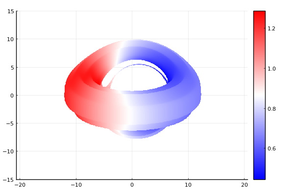
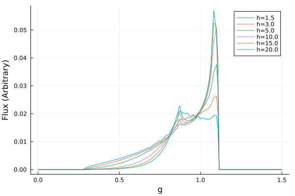
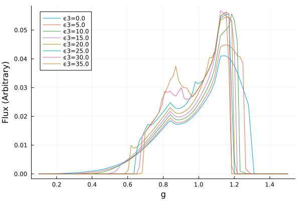
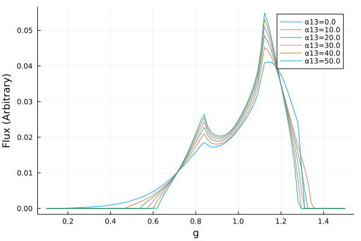

# Initial Gradus Testing
___

The below details initial experimentation with `Gradus.jl`. The code block below renders an image of a black hole with a thick accretion disk. Colour denotes the redshift of a given region on the disk.

```{julia}
#| eval: false

using Gradus
using Plots

# Function defining the cross section of the disk
function discCrossSection(x)
    centre = 8
    radius = 3

    if (x < centre - radius) || (radius + centre < x)
        zero(x)
    else 
        r = x - centre
        0.5(sqrt(radius^2 - r^2) + (0.5sin(3x)))
    end
end

# Metric Parameters
M = 1.0     # Mass
a = 0.7     # Black hole spin
α13 = 0.0   
α22 = 0.0
α52 = 0.0
ϵ3 = 0.0
i = deg2rad(70) # Inclination

# Instantiating the metric
m = JohannsenMetric(M, a, α13, α22, α52, ϵ3)

# Position of the observer
# (x[1], Distance, Inclination, x[4])
x = SVector(0.0, 1000.0, i, 0.0)

# Maximum affine time, parameterises the solution
# λ_max ~ 2*x[2]
λ_max = 2000.0

# Setting up impact parameters
α = range(-10.0, 10.0, 100)
β = range(-10.0, 10.0, 100)

# Getting an array of velocities from the impact parameters
vs = vec([map_impact_parameters(m, x, a, b) for a in α, b in β])
xs = fill(x, size(vs))

# Generating solutions
sols = tracegeodesics(m, xs, vs, λ_max, save_on = false)

# Generating points and reshaping to be the same shape as the image
points = unpack_solution.(sols.u)
points = reshape(points, (100, 100))

# Redshift point function
redshift = ConstPointFunctions.redshift(m, x)
redshiftGeometry = redshift ∘ ConstPointFunctions.filter_intersected()

# Disc
d = ThickDisc(r -> discCrossSection(r))

# this function returns the impact parameter axes
α, β, image = rendergeodesics(
    m, x, d, λ_max, pf = redshiftGeometry,
    # image parameters
    image_width = 200, image_height = 150,
    # the "zoom" -- use the impact parameter axes
    αlims = (-20, 20), βlims = (-15, 15), verbose = false
)

heatmap(α, β, image, aspect_ratio = 1)
```



Once familiarity was gained with the basics of `Gradus.jl` the line profile functionality was utilised through the following function.

```{julia}
#| eval: false
#| code-fold: false
function computeLineProfile(m, i, height, bins = range(0.0, 1.5, 180))
    # Position of the observer
    # (x[1], Distance, Inclination, x[4])
    x = SVector(0.0, 10000.0, i, 0.0)

    # Disk
    d = ThinDisc(0.0, Inf)

    # Setting up the model and profile
    model = LampPostModel(h = height)
    profile = emissivity_profile(m, d, model)

    # Computing the line profile
    bins, flux = lineprofile(m, x, d, profile; bins=bins, verbose=true)

    return bins, flux
end
```

This will allow for the investigation of the free parameters for the Johannsen metric; $\alpha_{13}$, $\alpha_{22}$, $\alpha_{52}$, and $\epsilon_3$. A lamppost corona model is used with variable height `h`. An example of the effect of varying the height of this corona is shown below.



Following initial experimentation the two functions above were integrated together for efficient investigation. The two free parameters that will be the focus of this investigation are $\alpha_{13}$ and $\epsilon_3$. Examples of the effects of these parameters on the emission lines are shown below





It can be seen that $\alpha_{13}$ has a very smooth, almost linear effect on the shape of the line, while $\epsilon_3$ is much more chaotic, particularly for $\epsilon_3>25$.