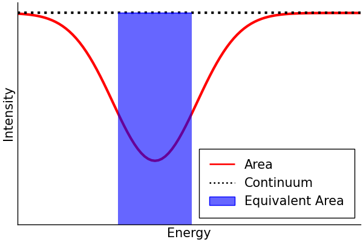

# Reading
___

## Summary of "Broad Iron Lines in Active Galactic Nuclei" [@BroadIronLines]

Fluorescent iron line, Fe-K$\alpha$, in the X-ray band at $6.4-6.9$ keV is the strongest narrow line emitted by an accretion disk around a black hole. Inverse Compton scattering of the soft photons (lower energy than the reactant particles) in a hot corona is the most likely candidate for the production of these X-rays. The emitted line is broadened and skewed due to the Doppler effect and gravitational redshift, and is often called the broad iron line due to being broadened to a FWHM of $5\times 10^4$ km s$^{-1}$.

![The profile of the broad iron line, image credit to Fabian (2000)[@BroadIronLines].](images/ShapeOfIronLine.jpg)

Soft Comptonisation (multiple inverse Compton scattering by hot thermal electrons) occurs giving a power law X-ray spectrum. Flares from active or flaring regions irradiate the accretion disk forming a "reflection" component in the spectrum.

![Reflection spectrum from a Monte Carlo simulation of an illuminated slab. The dashed line is the incident continuum and the solid line shows the reflected spectrum. Image credit Reynolds (1996)[@BroadIronLines]](images/ReflectionSpectrum.jpg){width=10cm}

The iron line is produced when one of the two K-shell electrons is ejected following absorption of an X-ray, the threshold for neutral iron is 7.1 keV. The resultant state can decay through the dropping of an L-shell electron into the K-shell, releasing 6.4 keV as either an emission line photon (34%) or an Auger electron (66%). Ionised iron has a photoelectric threshold and the K$\alpha$ of higher energy. The strength of the iron line is measured in terms of its equivalent width.

::: {.callout-note collapse="true" title="Equivalent Width"}
The equivalent width of a spectral line is the width of the rectangle which has the same area as that between the line and the continuum level.

{width=10cm fig-align="center"}
:::

The equivalent width is a function of the geometry of the accretion disk, the elemental abundances, the inclination angle, and the ionisation state.

::: {.callout-important collapse="false" title="Key Points"}
- **X-ray Continuum**: The hard X-ray continuum in AGNs and GBHCs is thought to be from active/flaring regions in the corona. Thermal electrons multiply inverse Compton scatter optical and UV photons from the disk to X-ray energies. A hard X-ray power law results and irradiates the accretion disk to produce a reflection component.
- **Reflection Component**: The reflection component causes the spectrum to flatten above 10 keV as Compton recoil reduces the backscattered flux and results in a strong fluorescent iron line at $\sim 6.4$ keV. The energy and strength of this line depends on iron abundance, inclination of the disk, and its ionisation state. A strong iron absorption edge may also be present from an ionised disk.
- **Iron Line Profile**: Doppler shifts, relativistic broadening and gravitational redshifting give the broad and skewed line profile. As the line comes from the innermost regions, these effects are very pronounced and may be used to determine the black hole spin and inclination angle of the accretion disk. In most Seyfert 1 galaxies, the disk is inclined at around 30$^\circ$, consistent with the standard model.
- **Observations**: The iron line was first clearly detected by Ginga and a line profile subsequently resolved by ASCA confirmed the broad and skewed shape expected from an accretion disk around a Schwarzschild black hole. RXTE has been used to study the line and continuum variability on shorter timescales, with reduced energy resolution.
- **Black Hole Spin**: The radius of the ISCO decreases with spin. Since the line profile is sensitive to the innermost radius of fluorescent emission this may be used to estimate the black hole, with some astrophysical assumptions. With present time-averaged observations such measurements may be ambiguous as alternative models with different values for the spin may produce identical line profiles. 
- **Alternative Models for the Production of the Broad Iron Line**: Alternative models that do not require an accretion disk appear to fail, in particular the line width cannot be entirely due to Comptonisation. Hybrid models in which the Comptonisation and Doppler/gravitational effects produce the profile are heavily constrained.
- **Variability**: Rapid X-ray continuum variability is observed in most AGNs, and the iron line is expected to vary in response to this with short time lag. Whilst these timescales are too short to be probed presently, significant and complex iron line variability has been observed. Often the line flux is seen to remain constant whilst the continuum changes, and there appears to be an anticorrelation between the reflected fraction and the equivalent width. In another study the reflected fraction and the photon index of the power law are correlated for individual objects and between different ones. These need to be explained as they appear contrary to our simple model of reflection. Flux correlated changes in the ionisation state of the disk may explain some of these facts.
- **Reverberation Mapping**: The rapid variability is associated with activation of new flares in the corona above the accretion disk. X-ray reverberation mapping uses observations of the iron line response to sudden changes in the continuum to study the accretion disk and black hole. This may be used to determine the geometry of the X-ray emission and the black hole spin and mass.
- **Other Classes of Object** Iron lines are observed in quasars, LLAGNs, radio-loud AGNs, and GBHCs. Quasars have the iron line decrease with increasing luminosity which may be due to the more luminous sources accreting closer to the Eddington limit being more highly ionised. Observations in LLAGNs may determine whether the accretion with low rates is an advection‐dominated accretion flow or a thin disk. Weak lines have been observed suggesting that their low accretion rate flows are thin disks rather than optically thick ADAFs. THe broad iron lines and reflection humps are weak or absent perhaps because the reflection signature is swamped by a beamed continuum. GBHCs show smeared absorption and emission features in the reflection spectra, and there is a debate as to the precise nature of the accretion flow within a few tens of Schwarzschild radii.
:::

___