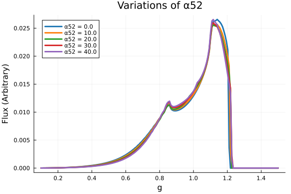
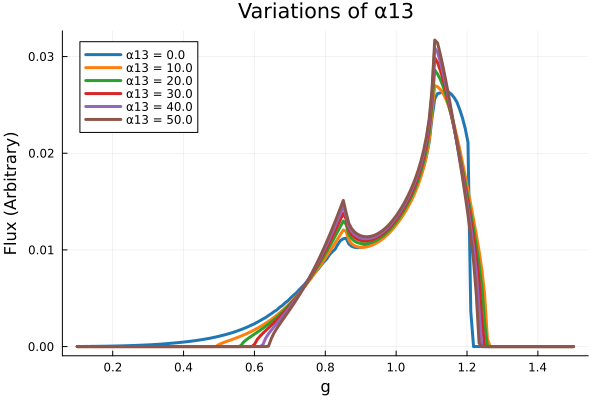
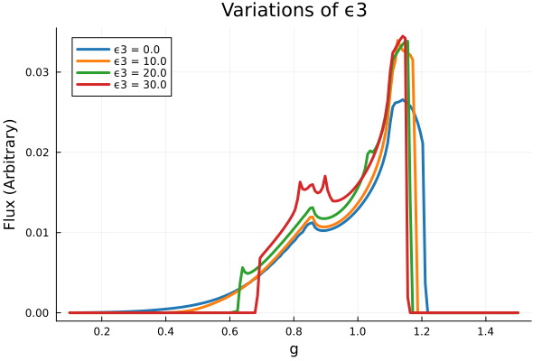
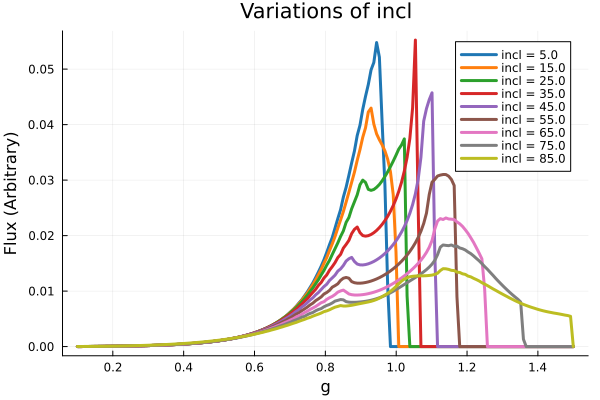
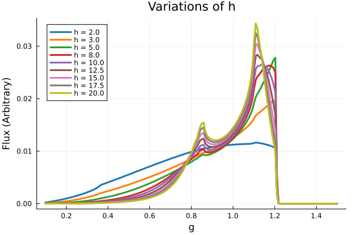
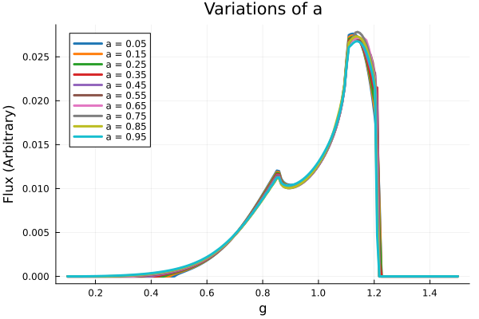
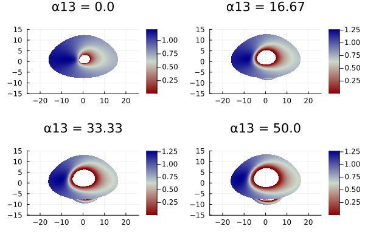
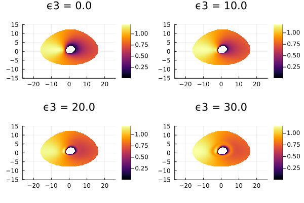
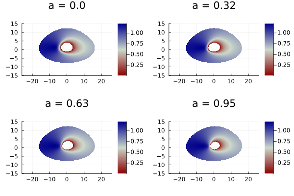

# Parameter Space Investigations
___
Code was set up to easily run several variations to the model which will allow for the investigation of the parameter space. A thin disk accretion model and a lamppost corona were used. It was set up such that for a given configuration of $h$, $a$, $i$, $\epsilon_3$, and $\alpha_{13}$ the line profile would be calculated and an image of the accretion disk produced and plotted together.

## Ruling out $\alpha_{22}$ and $\alpha_{52}$

Before exploring the 5D parameter space, tests were ran on both $\alpha_{22}$ and $\alpha_{52}$ such that their effects could be noted, should they be useful in the future.

{fig-align="center" width=70% #fig-alpha52}

Varying $\alpha_{52}$ showed near random, and near zero effect on the line and will thus be disregarded for this investigation. Varying $\alpha_{22}$ often failed to compute and will thus similarly be disregarded for this investigation.

## Exploring the 5-dimensional parameter space

Before varying the parameters it was necessary to determine the limits for useful variations. The spin is fundamentally limited to be $|a|<|M|$ and will thus be varied between 0 and 1. The ranges and default values for the parameter space are tabulated in @tbl-defaultsRanges.

| Parameter      | Minimum        | Maximum       | Default     |
|----------------|----------------|---------------|-------------|
| $\alpha_{13}$  | 0.0            | 50.0          | 0.0         |
| $\epsilon_{3}$ | 0.0            | 30.0          | 0.0         |
| $a$            | 0.0            | 1.0           | 0.998       |
| $h$            | $R_\text{ISCO}$| 30 $R_G$      | 10 $R_G$    |
| $i$            | 0.0$\degree$   | 90.0$\degree$ | 60$\degree$ | 

: The ranges and default values for the parameter space. {#tbl-defaultsRanges}

### Line profiles

::: {layout-ncol=2}

{fig-align="center" #fig-alpha13}

{fig-align="center" #fig-epsilon3}

{fig-align="center" #fig-inclination}

{fig-align="center" #fig-coronaHeight}

{fig-align="center" #fig-spin}

:::

- @fig-alpha13 shows that increasing the free parameter $\alpha_{13}$ sharpens the two peaks of the line, increases the maximum flux, and makes it more narrow. 
- @fig-epsilon3 shows that increasing the free parameter $\epsilon_{3}$ similarly increases the maximum flux, however the resultant profile is much more noisy. While $\alpha_{13}$ provided sharp peaks, $\epsilon_{3}$ provided broader peaks, particularly in the shorter one. 
- @fig-inclination shows that increasing the inclination smoothes out the line profile and shifts the peak to higher energies. The line is broadened significantly.
- @fig-coronaHeight shows that increasing the corona height makes the line profile sharper, increases the maximum flux, and shifts the maximum to slightly lower energies.
- @fig-spin shows that the spin had the least prominent impact on the profile of the line, seeming to only slightly decrease the height of the peaks with increasing spin. This may be an effect of the small range of spins available. It may therefore be informative to investigate this further by increasing the mass, using different corona heights, or varying the inclination.

### Redshift Image Renders

Alongside the line profiles, images of the accretion disk were rendered with a colourmap denoting the redshift of light from a given part of the disk. The corona height was not varied here as it did not impact the render.

{fig-align="center" #fig-alpha13Render width=80%}

{fig-align="center" #fig-epsilon3Render width=80%}

{fig-align="center" #fig-inclRender width=80%}

{fig-align="center" #fig-spinRender width=80%}

## Summary

:::{.callout-important title="Summary"}
- $\alpha_{22}$ and $\alpha_{52}$ had unpredictable or minimal effect on the line profile and rendered images so are therefore to be disregarded.
- $a$: Increasing the spin appears to shrink the ISCO of the accretion disk. Its effect on the line profile is less obvious, it appears to decrease the flux slightly but is otherwise negligible.
- $h$: Increasing the corona height makes the line profile sharper and increases the peak flux, while decreasing the energy of the peak. It has no effect on the renders.
- $\theta$: Increasing the inclination (where 0 degrees has the accretion disk face-on) smoothes out the line profile and increases the peak energy. The effect of redshift becomes more apparent with increased inclination.
- $\alpha_{13}$: Increasing $\alpha_{13}$ appears to increase the radius of the ISCO and make the line profile sharper.
- $\epsilon_3$: Increasing $\epsilon_3$ increases the height of the line profile, and makes it more chaotic.
:::

## Code Specifics

The workhorse of the parameter investigations was the utility function `JohannsenParamVar` which sets up the metric and observer position and then calls either `ComputeLineProfile` or `RenderImage`. This utility function was made versatile using keyword arguments allowing for different methods to be called within it. This was then wrapped in `ParamLoop` which took the index (the variable to be looped through) and a set of values to call `JohannsenParamVar` for. 

To maximise readablity of the redshift images, a custom colormap is made through `RedshiftColormap` which gives red for any values $<1$, blue for those $>1$, and white for those $=1$. This gave the images seen in @fig-alpha13Render - @fig-spinRender.