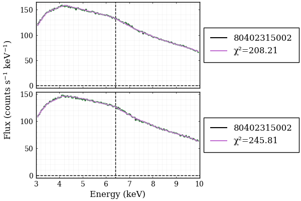

# Developing and Migrating to a Table Model

## Introduction

Due to having to render the line profile through Gradus upon every iteration of the fit, the model took a significant amount of time to fit to the data. Thus other methods were looked into and it was decided to develop a table model, allowing for the pre-computation of the line profiles. The computed profiles could then be interpolated between for a given set of parameters, significantly speeding up computation. This would of course decrease the accuracy of the model, however the increased efficiency would likely be worth that loss.

The structure for XSPEC table models is well documented at [XSPEC Table Models](https://heasarc.gsfc.nasa.gov/FTP/caldb/docs/memos/ogip_92_009/ogip_92_009.pdf) @XSPECModelSpecification, thus the model was constructed using this specification. `SpectralFitting.jl` also has compatibility with this model format, which made integration more viable (see [here](https://github.com/JuliaAstro/SpectralFitting.jl/blob/main/src/meta-models/table-models.jl) for more @SpectralFitting).

## Data Generation

The spectra for the model were simply generated by looping through a defined parameter space, with a given number of values for each of the 5 parameters. The values selected were defined as follows

| Parameter     | Lower Bound | Upper Bound | Number |
|---------------|-------------|-------------|--------|
| $a$           | -0.998      | 0.998       | 7      |
| $h$           | 1.5         | 30          | 10     |
| $\theta$      | 5           | 85          | 10     |
| $\alpha_{13}$ | 0           | 50          | 7      |
| $\epsilon_3$  | 0           | 30          | 10     |

This gave a total of 49,000 combinations to loop through. Seven values were used for both $a$ and $\alpha_{13}$ as they had the smallest, and most predictable effect on the line profile, respectively. In a later iteration of this model it would be ideal to have a larger parameter space to reduce the innacuracies of interpolation, however for a test case it was necessary to keep compute times down. The line profiles were stored in columns of a CSV with the header containing the parameter information. 

Certain parameter combinations would fail to compute, and therefore a log file was kept, noting the combination and when it failed. This allowed the computations to run over night without risk of an error. The final compute time for this data generation was 16 hours. 3,500 of the 49,000 did not compute correctly, thus there is 45,500 datapoints in the grid. 

## Loading into FITS Format

This data was then loaded into a FITS file following the XSPEC model format using the python wrapper for the `heasp` C library, `heasoftpy` (see the [documentation](https://heasarc.gsfc.nasa.gov/docs/software/lheasoft/headas/heasp/node2.html) for more information). The model specification requires that the grid be rectilinear @XSPECModelSpecification, thus it was not possible to simply disregard the failed runs, and the spectra for these combinations was set to be zeroed out. This was determined to be acceptable as the majority of the failed runs had large $\alpha_{13}$ or $\epsilon_3$, which from earlier testing was noted to be unlikely during fitting, thus the failed combinations would be unlikely to be used for interpolation. 

## The Model

To create a model in SpectralFitting using the table, the data was loaded into a `TableModelData` struct. This could then be wrapped using `TableModelInterpolation` such that it can work with the `TableModelInterpolation` function. This functionality made it trivial to set up the interpolation through the parameter grid by simply calling
```
SpectralFitting.interpolate_table!(table, a, h, θ, α13, ϵ3)
```
This returned a spectrum with 1000 datapoints, which could then be interpolated over the domain of the input data. With this architecture it was simple to fit the data as previous. 

### Performance

Using the nu80402315002 dataset as before, the new model yielded the following results.

{fig-align="center"}

{fig-align="center"}

Comparing to the previous fits, the $\chi^2$ value for both of these fits were surprisingly improved. The Kerr fit was completed by freezing the deformation parameters at 0. 

These fits took only 30 seconds to fit and plot both metrics, which was significantly faster than previous which could take an hour or more for a single fit. 

## Next Steps

After review of the log file, it was found that a lot of the cases where the deformation parameters were zero failed. This is significant as it implies that many of the Kerr model interpolations are innacurate due to the "correction" method used (setting missing values to zero). Using code to parse the unique values for each of the 5 parameters, it was found that every instance of failure had $h=1.5$. It was thus decided that upon the next iteration of the model, the lower bound of $h$ would be set to 3. This value was determined after some brief testing with the failed runs, manually setting $h=3$. $h=2$ was also attempted, however this similarly caused errors.

Building on what was discussed in the previous chapter regarding the lower bounds for the parameters, it was also tested whether a value of -1  computed correctly for both of the deformation parameters. This was successful and thus a partial implementation of these bounds can be completed. 

Further testing was also conducted in the parameter space of $a$ where it was found that the line profile does not change with the sign of $a$. This will allow for much more resolution without increasing the length of computation.

To use the negative deformation parameters, their allowed values must be reduced as it is necessary to have confidence in the deformation = 0 (Kerr) cases. They will therefore take the values $\alpha_{13}, \epsilon_3 \in [-1, 10], \mathbb{Z}$. The other variables will take $h\in[3,15]$, $a\in[0,0.998]$ and $\theta\in [5,85]$. Thus 7 values will be taken for $a$, 12 for the deformation parameters, and 9 for $h,\;\theta$, giving a total size of 81648 for the table.

The final iteration that needs to be made upon the data is to increase the domain, as the model is currently forced to extrapolate causing unexpected issues, likely forcing the fitting to take worse values to avoid these errors