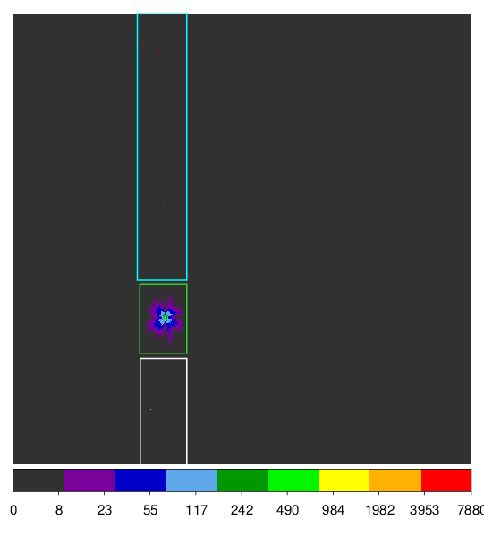
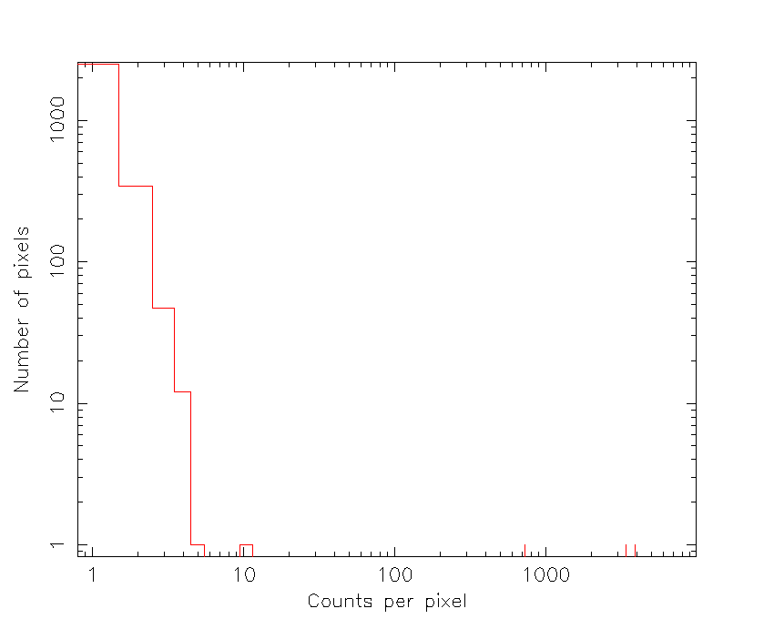
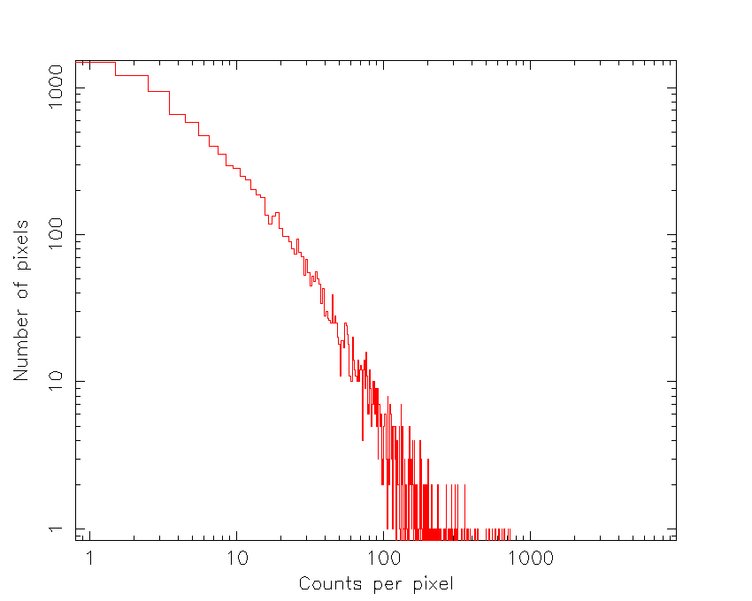
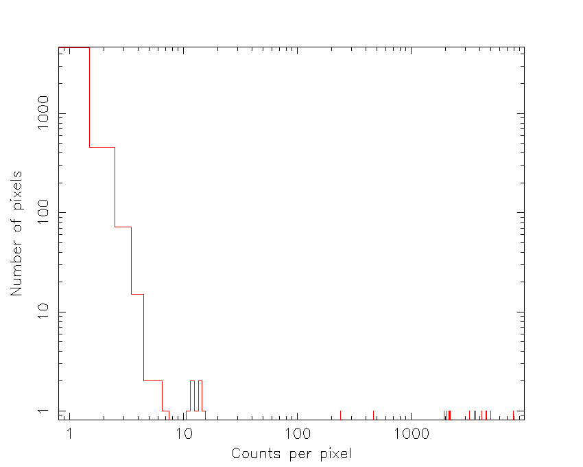
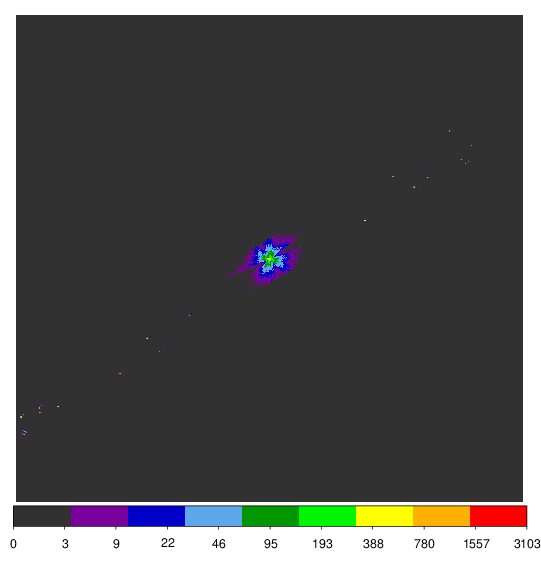
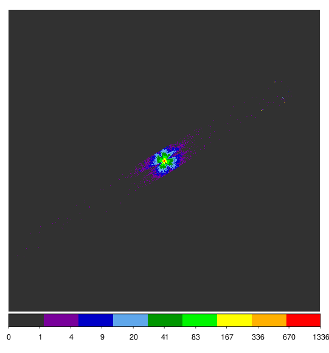
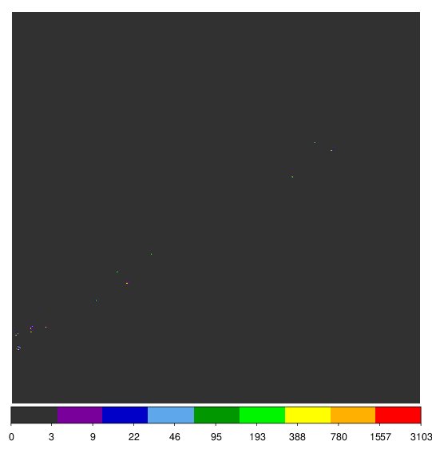
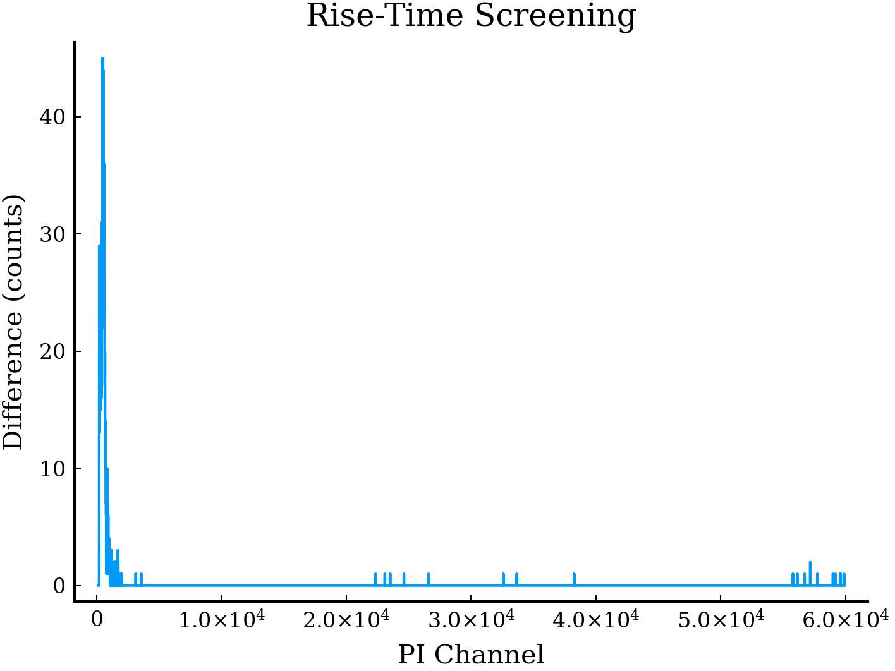
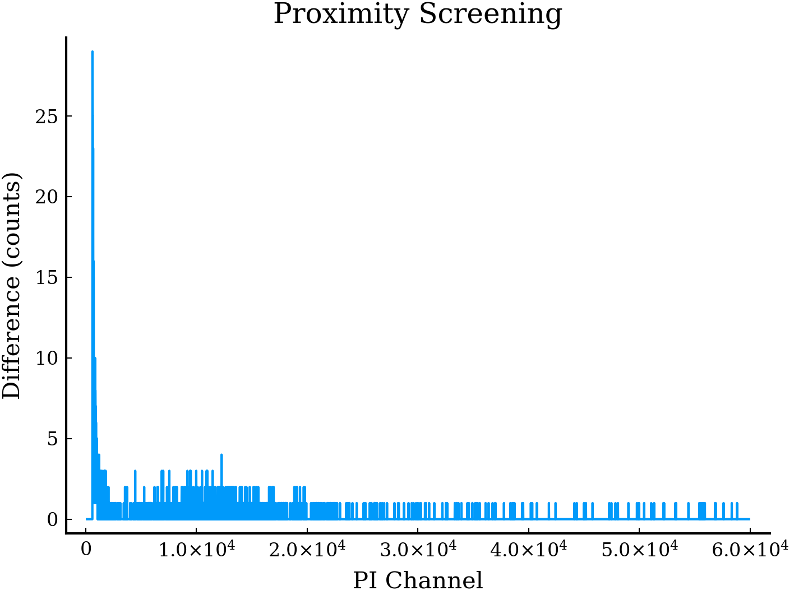
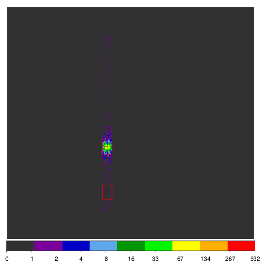

# Notes for the Reduction of XRISM Data

With HEASOFT and CalDB installed and instantiated:

- Data will have observation ID as top directory, e.g. 000125000/
- Pipeline scripts must be run in a directory that contains this directory

## Pipeline Scripts

For all following commands replace `000125000` with the obsid for your data. All commands here are run starting from the `000125000/` directory.

### Reprocessing:

In the directory above data directory run the following for the resolve data
```{.bash .code-overflow-wrap .eval-false}
# Run the pipeline
xapipeline indir=000125000 outdir=000125000_rsl_reproc steminputs=xa000125000 stemoutputs=DEFAULT entry_stage=1 exit_stage=3 instrument=resolve verify_input=no create_ehkmkf=no calc_pointing=yes calc_optaxis=yes calc_gtilost=no calc_adrgti=no calc_mxsgti=no rsl_gainfile=CALDB calmethod=FE55 linetocorrect=MnKa seed=650504 numevent=1000 minevent=200 extraspread=40 spangti=no

# Pack and cleanup logs
7z a 000125000_rsl_logs.7z *.log
rm *.log

# Enter the directory, remove duplicate files and gzip
cd 000125000_rsl_reproc
rm *.hk
gzip *

cd ..
```

Then for the Xtend data
```{.bash .code-overflow-wrap .eval-false}
# Run the pipeline
xapipeline indir=000125000 outdir=000125000_xtd_reproc steminputs=xa000125000 stemoutputs=DEFAULT entry_stage=1 exit_stage=3 instrument=xtend verify_input=no create_ehkmkf=no calc_pointing=yes calc_optaxis=yes seed=650504

# Pack and cleanup logs
7z a 000125000_xtd_logs.7z *.log
rm *.log

# Enter the directory, remove duplicate files and gzip
cd 000125000_xtd_reproc
rm *.hk
gzip *

cd ..
```

### Analysis Setup

Then make a directory for the analysis and copy the following files
```{.bash .code-overflow-wrap .eval-false}
mkdir analysis

cp 000125000_xtd_reproc/*_cl.evt.gz analysis/
cp 000125000_rsl_reproc/*_cl.evt.gz analysis/
cp 000125000_rsl_reproc/xa000125000.ehk.gz 000125000_rsl_reproc/xa000125000rsl_px1000_exp.gti.gz 000125000_xtd_reproc/xa000125000xtd_p031100010.bimg.gz analysis/
```

### PSP Limit Checks

Run PSP limit check to see if the unscreened count rate exceeds the psp limit.
```{.bash .code-overflow-wrap .eval-false}
rslbratios infile=xa000125000rsl_p0px1000_uf.evt.gz filetype=uf outroot=rsl000125000_ufbr
```
This gives a info on if quadrants exceed 50 cts s^-1, which makes the data unusable. Next run rslbratios on the cleaned resolve data:
```{.bash .code-overflow-wrap .eval-false}
rslbratios infile=xa000125000rsl_p0px1000_cl.evt.gz filetype=cl outroot=rsl000125000_clbr lcbin=128.0
```
This gives the same info but for the cleaned data and outputs the following which will be used later

- `rsl000125000_clbr_2keVto12keV_hist.fits`: Observed vs. predicted branching ratios in the energy range specified by the “eband” parameter
- `rsl000125000_clbr_full_lc.fits`: Full array light curves by grade
- `rsl000125000_clbr_pix_lc.fits`: Per-pixel light curves by grade
- `rsl000125000_clbr_gradeFrac_lc.fits`: Grade fractions versus time
- `rsl000125000_clbr_2keVto12keV_pixMap.img`: 20 images of counts by grade, and grade fractions for two energy bands

## Removing Anomalous Pixels from Xtend Data

All following commands are run from the `000125000_xtd_reproc/` directory

First generate region files using ds9, viewing the image in DET coordinates with the command. 
```{.bash .code-overflow-wrap .eval-false}
ds9 "xa000125000xtd_p031100010_cl.evt.gz[bin=detx,dety]"
```

{fig-align="center"}

Three regions were selected and labelled as follows:

- White: `1_bottom.reg`
- Green: `1_src.reg`
- Cyan: `1_top.reg`

```{.bash .code-overflow-wrap .eval-false}
punlearn xtdpixclip
xtdpixclip evtinfile="xa000125000xtd_p031100010_cl.evt.gz" outroot="xa000125000xtd_p031100010_cl" pmode=histo nhistbins=-1 incregionfiles="1_top.reg,1_bottom.reg,1_src.reg" emax=24.575 chatter=2 clobber=yes
```

The above is used to determine the thresholds to use as cutoffs for anomolous pixels. The output histograms are shown below

::: {layout-ncol=2}

{fig-align="center"}

{fig-align="center"}

{fig-align="center"}

:::

from these histograms it is possible to select the thresholds to cut off anomolous data. For the two non-source regions a threshold of 8 was selected, and for the source region 1000 was selected. With the regions selected run

```{.bash .code-overflow-wrap .eval-false}
punlearn xtdpixclip
xtdpixclip evtinfile="xa000125000xtd_p031100010_cl.evt.gz" outroot="xa000125000xtd_p031100010_cl" pmode=apply thresholds="20,20,600" incregionfiles="1_top.reg,1_bottom.reg,1_src.reg" emax=24.575 chatter=2 clobber=yes
```

::: {layout-ncol=2}

{fig-align="center"}

{fig-align="center"}

{fig-align="center"}

:::

## Proximity and Rise time screening

- Proximity screening: Removing frame events based on the unlikelihood of events happening too close together in a given time interval. This must be balanced against the loss of counts.
- Rise-time screening: 

The effect of both can be previewed through the FITS files 
```
rsl000125000_clbr_prox_Hp_spectra.fits
rsl000125000_clbr_rise_Hp_spectra.fits
```

These were examined using the following julia script

```{.julia .eval-false}
using FITSFiles
using Plots

file = fits("/home/brad/Downloads/000125000_rsl_reproc/rsl000125000_clbr_rise_Hp_spectra.fits")

display(plot(file[3].data.PI, file[3].data.DIFF; xlabel="PI Channel", ylabel="Difference (counts)", title="Rise-Time Screening", label=nothing))

file = fits("/home/brad/Downloads/000125000_rsl_reproc/rsl000125000_clbr_prox_Hp_spectra.fits")

display(plot(file[3].data.PI, file[3].data.DIFF; xlabel="PI Channel", ylabel="Difference (counts)", title="Proximity Screening", label=nothing))
```

::: {layout-ncol=2}

{fig-align="center"}

{fig-align="center"}

:::

The losses for each were determined to be worth it for this dataset, thus the both filters were applied with the command:

```{.bash .code-overflow-wrap .eval-false}
ftcopy infile="xa000125000rsl_p0px1000_cl.evt[EVENTS][(PI>=600) && (((((RISE_TIME+0.00075*DERIV_MAX)>46)&&((RISE_TIME+0.00075*DERIV_MAX)<58))&&ITYPE<4)||(ITYPE==4))&&STATUS[4]==b0]" outfile=xa000125000rsl_p0px1000_cl2.evt copyall=yes clobber=yes history=yes
```

To skip proximity filtering you can omit `&&STATUS[4]==b0`.

## Extract Broadband Images and Establish Source Center Coordinates

- Check the value of the EXPOSURE keyword in the cleaned event files, if the exposure time is unexpectedly low then consult section 9 of the [XRISM QSG](https://heasarc.gsfc.nasa.gov/docs/xrism/analysis/quickstart/xrism_quick_start_guide_v3p2_251204a.pdf).
- You should now have the following files
    - `xa000125000rsl_p0px1000_cl2.evt` (Resolve) and
    - `xa000125000xtd_p031100010_cl.evt` or `xa000125000xtd_p031100010_xpc_clnevt.fits` (Xtend)

Start XSELECT and make a 2-10 keV resolve image in DET coordinates as:

```{.bash .code-overflow-wrap .eval-false}
terminal> xselect
xselect> read eve xa000125000rsl_p0px1000_cl2.evt .
xselect> set image DET
xselect> filter pha_cutoff 4000 20000
xselect> extr image
xselect> save image xa000125000rsl_p0px1000_detimg.fits
```

The centre should be close to (3.5, 3.5), we only need to estimate this approximately as it is used as a sanity check against the RA and DEC coordinates. For most standard observations we can simply assume this centre coordinate.

Next copy over a resolve region file 

```{.bash .code-overflow-wrap .eval-false}
cp $HEADAS/refdata/region_RSL_det.reg .
```

and make another region file `exclude_calsource.reg` containing
```
physical
-circle(920.0,1530.0,92.0)
-circle(919.0,271.0,91.0)
```

Next make a 0.5-10 keV Xtend image in DET coordinates

```{.bash .code-overflow-wrap .eval-false}
xselect> clear all
xselect> read eve xa000125000xtd_p031100010_xpc_clnevt.fits.gz .
xselect> set image DET
xselect> filter region exclude_calsources.reg
xselect> filter pha_cutoff 83 1667
xselect> extr image
xselect> save image xa000125000xtd_p031100010_detimg.fits
```

Now we can estimate the centroid of the source in DET coordinates using `ds9`, it is reccommended to use a rectangle of length 5 arcmin and width as wide as possible for 1/8 Window mode images. For full window mode it is reccommended to use a circle of radius 2.5 arcmin. The regions selected here are shown below

{fig-align="center"}

and were saved as 

```
region_000125000xtd_src.reg
region_000125000xtd_bgd.reg
```